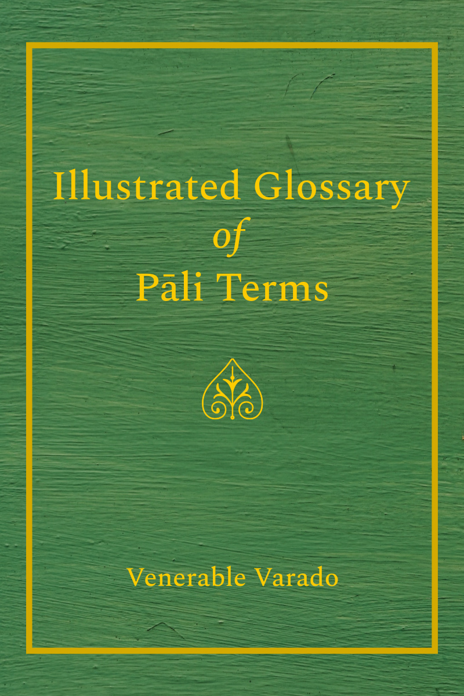

= Illustrated Glossary of Pāli Terms
:booktitle: {doctitle}
:author: Venerable Varado
:contact: pali.glossary@gmail.com
:creator: {author}
:revnumber: v1.0
:revdate: 2018-04-28
:doctype: book
:lang: en
:source: https://pali-glossary.github.io/
:keywords: Pali, language, glossary, dictionary, Dhamma, Buddhism, RELIGION / Buddhism / Theravada
:copyright: Creative Commons Zero v1.0 Universal
:identifier: Illustrated-Glossary-of-Pali-Terms
:imagesdir: assets/photos/92dpi-ebook-sRGB
:includes: manuscript/asciidoc
:front-cover-image: 
:toc: left
:toc-title: Contents
:toclevels: 2
:table-caption!:
:example-caption!:
:listing-caption!:
:stylesheet: assets/stylesheets/glossary.css
:google-analytics: UA-3557338-13

include::{includes}/notices.adoc[]

// #sections begin#

include::{includes}/glossary.adoc[]

// #sections end#

include::{includes}/introduction.adoc[]

include::{includes}/changelog.adoc[]

include::{includes}/copyright.adoc[]

